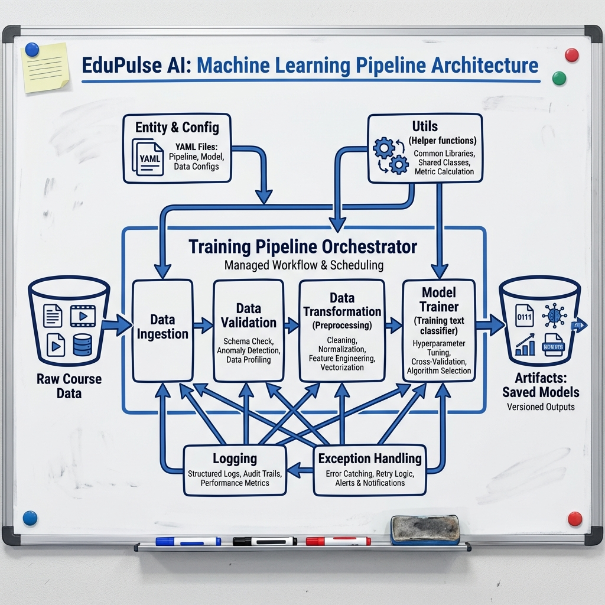

# EduPulse: AI-Driven Course Feedback Intelligence



## 🚀 Overview

**EduPulse** is an advanced AI Quality Assurance System designed for EdTech platforms. Unlike simple sentiment classifiers, EduPulse acts as an intelligent "Voice of Customer" agent that reads thousands of student reviews to detect actionable business insights.

It goes beyond "Positive/Negative" to identify specific issues like **"Audio Quality"**, **"Content Outdated"**, or **"Instructor Pace"**, enabling data-driven curriculum improvements.

## 🏗️ System Architecture

The project follows a production-grade MLOps architecture:

- **Orchestrator**: Centralized pipeline management.
- **Ingestion**: Automated splitting of raw data (8,000+ reviews).
- **Transformation**: NLP preprocessing and vectorization.
- **Training**: Modular model training with artifact versioning.
- **Deployment**: Interactive Streamlit Dashboard for real-time inference.

## 📂 Project Structure

```
Business_Optima_Assignment/
├── .gitignore
├── README.md
├── requirements.txt
├── setup.py
├── EduPulse_System_Architecture.png
├── architecture_concepts/      # Design variations & prompts
├── notebooks/                  # Experimental analysis
└── src/                        # Source Code
    ├── logger.py               # Custom Logging
    ├── exception.py            # Error Handling
    ├── components/             # Ingestion, Transformation, Trainer
    └── pipeline/               # Training & Prediction Pipelines
```

## 🛠️ Getting Started

### 1. Installation

```bash
pip install -r requirements.txt
```

### 2. Run Training Pipeline

```bash
python src/pipeline/training_pipeline.py
```

### 3. Launch Dashboard

```bash
streamlit run app.py
```

## 📊 Features

- **Smart Classification**: Detects Technical vs. Content issues.
- **Real-time Inference**: Test new reviews instantly.
- **Executive Dashboard**: Visualize course health trends.
- **Robust Logging**: Full audit trail of pipeline execution.
